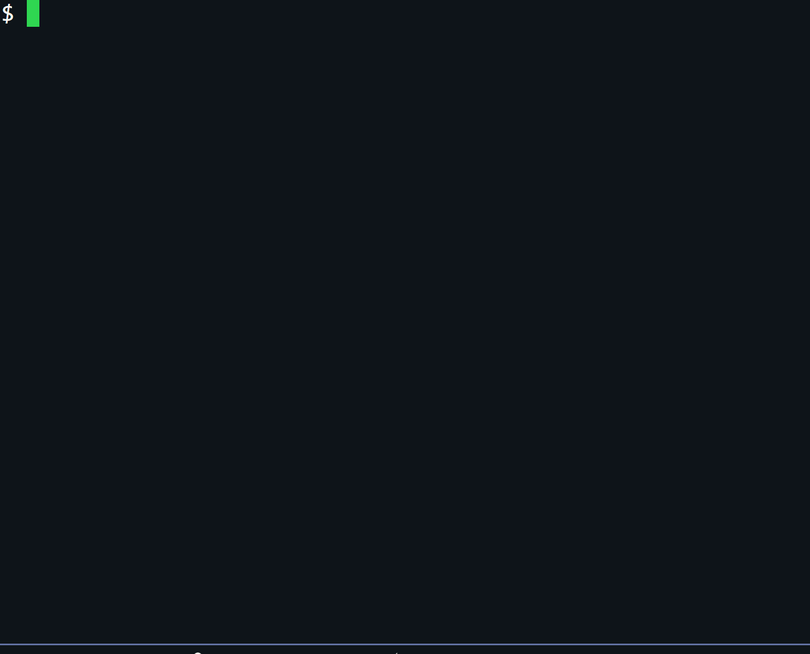
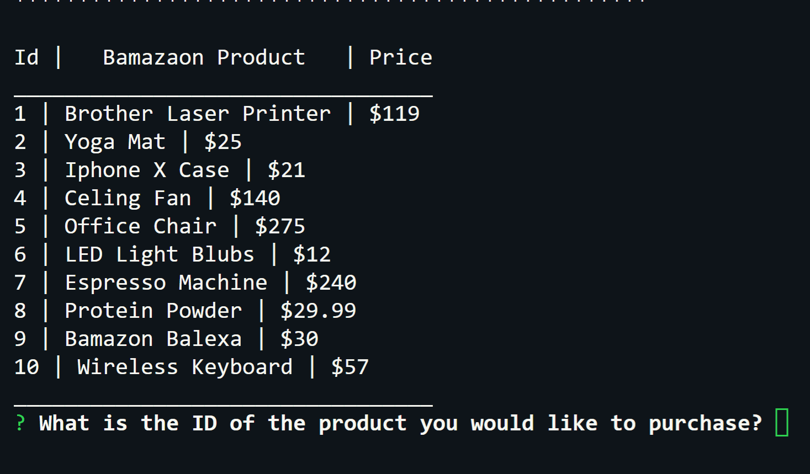

# Bamazon


>

## Table of contents

* [General info](#general-info)
* [Setup](#setup)
* [Examples](#examples)
* [Technologies](#technologies)

## General info


## Setup

Bamazon requires [Node.js](https://nodejs.org/) v4+ to run.

Install npm package manage and dependencies then input desired commands.

```sh
$ cd bamazon
$ npm install
$ node bamazonCustomer.js
```

## Examples





## Technologies

* [Node.js](https://nodejs.org/)- evented I/O for the backend
* [JavaScript](https://www.javascript.com/)
* [NPM](https://www.npmjs.com/) - Package manager
* [MySQL](https://www.mysql.com/) 
